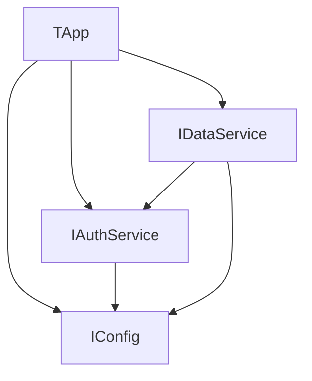

# Loom Dependency Injection Container for Delphi

Loom is a lightweight, attribute-based Dependency Injection (DI) container for Delphi, designed to simplify dependency management in Object Pascal applications. It supports constructor/property injection, interface resolution, singleton/prototype scopes, and circular dependency detection.

## Key Features

- 🏗️ Constructor & Property Injection

Automatically resolves dependencies using constructors and `[Autowired]` properties

- 🔄 Singleton & Prototype Scopes

Control instance lifecycle with `TScope.Singleton`

- 🧩 Interface-Based Services

Register implementations with `[Implements]` attributes

- 🛡️ Circular Dependency Detection

Runtime detection of cyclic dependencies

- 📦 Default Container Instance

Global access via `LoomContainer.GetDefaultContainer`

- ✅ Comprehensive Unit Tests

Includes DUnitX test coverage for container registration, resolution, and error cases

## Why Loom Exists

**Loom** is an exploratory/study project created to deepen understanding of **dependency injection** concepts in **Delphi**. It serves several educational purposes:

### 🧪 DI Pattern Exploration

Investigates how **dependency injection patterns** can be implemented effectively in Delphi's **OOP paradigm**.

### ⚙️ RTTI Capability Testing

Leverages Delphi's **Run-Time Type Information (RTTI)** for **reflection-based dependency resolution**.

### 🧠 Learning Experience

Created as a hands-on way to understand:

- **Dependency graph resolution**
- **Lifecycle management**
- **Circular dependency detection**
- **Attribute-based programming in Delphi**

### 🔍 Delphi Language Study

Explores advanced language features:

```pascal
// Attribute usage example
[Service]
[Implements(IConfig)]
TFileConfig = class(TInterfacedObject, IConfig)
```

While functional, Loom is primarily an educational project and lacks some production-ready features such as extensive validation, multithreaded safety, or full lifecycle hooks.

## Getting Started

### 1. Registration

```pascal
// Manual registration
Container.RegisterInterface(IWeapon, TSword);
Container.RegisterComponent(TWarrior);

// Attribute-based (auto-discovery)
[Component]
TWarrior = class
  constructor Create(AWeapon: IWeapon);
end;

[Service]
[Implements(IConfig)]
TFileConfig = class(TInterfacedObject, IConfig)
```

### 2. Resolution

```pascal
// Resolve class
var Warrior := Container.Resolve(TWarrior);

// Resolve interface
var Weapon := Container.ResolveInterface<IWeapon>;
```

### 3. Scopes

```pascal
// Singleton (single instance)
Container.RegisterComponent(TSingletonTest, TScope.Singleton);

// Prototype (new instance each time)
Container.RegisterComponent(TPrototypeTest, TScope.Prototype);
```

## Advanced Usage

### 1. Constructor Injection

```pascal
[Component]
TCustomWarrior = class
public
  constructor Create(AWeapon: IWeapon; AShield: IShield);
end;

// Registration
Container.RegisterComponent(TCustomWarrior);
Container.RegisterInterface(IWeapon, TSword);
Container.RegisterInterface(IShield, TKnightShield);
```

### 2. Property Injection (Autowired)

```pascal
[Component]
TApp = class
private
  FGreetingService: TGreetingService;
public
  procedure Run;

  [Autowired]
  property GreetingService : TGreetingService read FGreetingService write FGreetingService;
end;
```

### 3. Named Interface Registrations

```pascal
// Register implementations with names
Container.RegisterInterface(IWeapon, TSword, TScope.Singleton, 'Sword');
Container.RegisterInterface(IWeapon, TShuriken, TScope.Singleton, 'Shuriken');

// Resolve by name
var Shuriken := Container.ResolveInterface<IWeapon>('Shuriken');
```

## Project Structure

| File                          | Description                        |
|------------------------------|----------------------------------|
| `Loom.Attributes.pas`         | Custom attributes (`Component`, `Autowired`) |
| `Loom.Container.pas`          | Main container class             |
| `Loom.Container.DataTypes.pas`| Core types (`TScope`)            |
| `Loom.Container.Registry.pas` | Component registration logic    |
| `Loom.Container.Resolver.pas` | Dependency resolution engine    |
| `Loom.Container.Tests.pas`    | Unit tests (`DUnitX`)            |

## Example Complex Project

### Dependency Graph



### Execution Flow

```pascal
begin
  Container.RegisterComponent(TFileConfig);
  Container.RegisterComponent(TAuthService);
  Container.RegisterComponent(TAdvancedDataService);
  Container.RegisterComponent(TApp);

  App := Container.Resolve<TApp>; // Resolves all dependencies automatically
  App.Run; 
end;
```

## 🔄 AutoRegister and Class Linking (Detailed Explanation)

The AutoRegister method scans all loaded RTTI types to find classes marked with `[Component]` or `[Service]` attributes and registers them automatically. You provide a unit name pattern (e.g., 'Example.Medium.*') and it attempts to find matching classes via RTTI.

### Why do we need to force class references in initialization?

Delphi’s compiler and linker perform aggressive dead code elimination. If a class is not referenced anywhere in your code or its unit is not included in the final binary, its RTTI information may be discarded during linking.

This means that AutoRegister will not find those classes by RTTI because the RTTI data is missing at runtime, even if the class exists in your source code.

### How to ensure RTTI is available for AutoRegister?

You have two main options:

#### 1. Force referencing in the unit’s initialization section

Add a dummy call like this:

```pascal
initialization
  TConsoleLogger.ClassName; // Forces Delphi linker to keep this class and its RTTI
end.
```

This tells the linker that the class is used, so its RTTI info is preserved. This approach is preferred as it keeps the linkage concern close to the class declaration and unit.

#### 2. Force reference from the main unit

If you cannot or do not want to modify the class unit, explicitly reference the class in your main unit:

```pascal
initialization
  LoomContainer.ForceReferenceToClass(TConsoleLogger);
  LoomContainer.ForceReferenceToClass(TDatabaseService);
  LoomContainer.ForceReferenceToClass(TApp);
end.
```

This achieves the same effect: ensures the classes and their RTTI survive the linker’s dead code elimination, enabling AutoRegister to discover and register them.

#### Summary

- AutoRegister relies on runtime RTTI data to find and register classes.
- Delphi’s linker removes unused classes and their RTTI unless explicitly referenced.
- You must force a reference to ensure the RTTI is included.
- Doing so allows AutoRegister to work correctly without needing manual registration.

## 📜 License

MIT License
